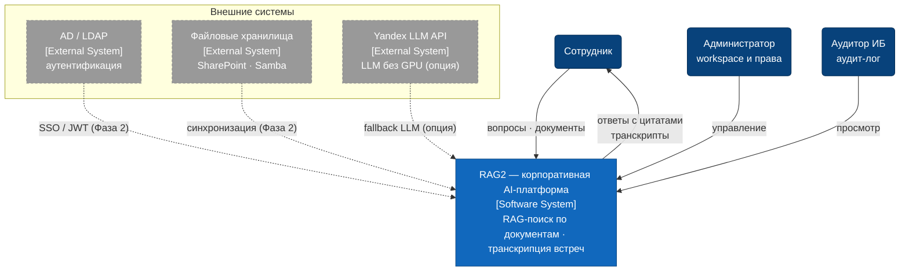

# C4 Level 1 — Context Diagram

Система в окружении: пользователи, администратор, аудитор и внешние системы.

## Комментарии

- **Персоны** — сотрудник (основной сценарий: вопрос → ответ с цитатами), администратор (workspace, права, пользователи), аудитор ИБ (просмотр append-only аудит-лога).
- **AD / LDAP и файловые хранилища** — интеграции целевой архитектуры (Фаза 2): сейчас аутентификация — собственная (JWT, bcrypt), документы загружаются через UI/ingestion API. Показаны на контексте, чтобы границы системы были видны сразу.
- **Yandex LLM API** — фактическая внешняя система в MVP при работе без GPU: LLM-инференс уходит наружу (fallback-провайдер). На целевом on-premise контуре заменяется внутренним vLLM и из списка исчезает.
- **Календарь встреч (Exchange)** убран из MVP-контура: приём аудио — через загрузку файла в UI, а не интеграцию с календарём.