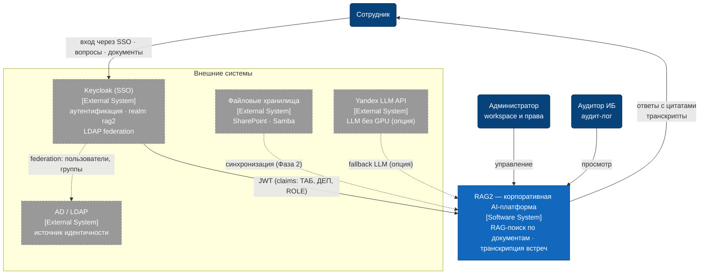

# C4 Level 1 — Context Diagram

Система в окружении: пользователи, администратор, аудитор и внешние системы.

## Комментарии

- **Персоны** — сотрудник (основной сценарий: вопрос → ответ с цитатами), администратор (workspace, права; пользователи управляются в Keycloak), аудитор ИБ (просмотр append-only аудит-лога).
- **Keycloak** — единственная точка аутентификации (SSO). Токен содержит claims из LDAP: `employee_no` (ТАБ-хххх), `email`, `full_name`, `dept_code` (ДЕП-хххх), `role: [ADMIN|EMPLOYEE]`. Backend — resource server: валидация JWT по JWKS, локальных паролей нет.
- **AD / LDAP** — источник идентичности через federation Keycloak; в dev/демо пользователи создаются прямо в realm.
- **Файловые хранилища** — интеграция Фазы 2: документы загружаются через UI/ingestion API.
- **Yandex LLM API** — фактическая внешняя система в MVP при работе без GPU: LLM-инференс уходит наружу (fallback-провайдер). На целевом on-premise контуре заменяется внутренним vLLM и из списка исчезает.
- **Календарь встреч (Exchange)** убран из MVP-контура: приём аудио — через загрузку файла в UI, а не интеграцию с календарём.