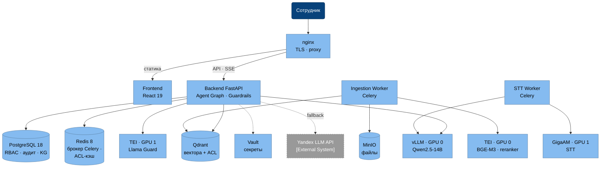

# C4 Level 2 — Container Diagram

Контейнеры соответствуют сервисам `infra/docker-compose.yml` — фактический MVP-деплой.

Компоновка блоками: сверху вход (DMZ), ниже Control Plane, ниже Data Plane; стрелки между блоками — вертикальные.

## Комментарии

- **Agent Graph (LangGraph) и Guardrails — модули Backend API**, а не отдельные контейнеры: guardrails-узлы и planner/retrieve/react работают внутри процесса uvicorn; при масштабировании выносятся без изменения кода.
- **Redis** — брокер очередей Celery (задачи ingest/stt попадают в workers через него) и кэш ACL (TTL 60с); на диаграмме это отражено в подписи, стрелки брокера опущены для читаемости.
- **Упрощения потоков:** Ingestion Worker пишет метаданные в PostgreSQL, STT Worker сохраняет аудио в MinIO — эти стрелки опущены (дублируют уже показанные связи с теми же БД); полная матрица потоков — в Deployment Diagram (04).
- **Control Plane** (Backend, workers) — stateless, масштабируется репликами; **Data Plane** — в изолированной сети (`internal: true`), GPU-сервисы поднимаются профилем `gpu`.
- **Yandex LLM API** — fallback-провайдер для работы без GPU (локальная разработка); на целевом on-premise контуре не используется.