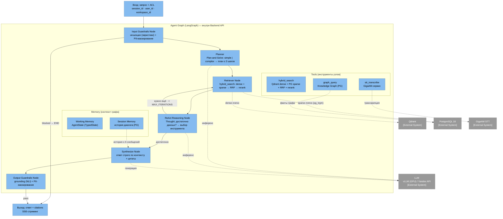
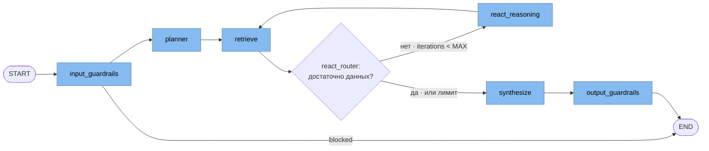

# C4 Level 3 — Component Diagram: Backend API (Agent Graph)

**Разбираемый компонент (по C2):** Backend API (FastAPI) — его внутренняя часть **Agent Graph (LangGraph)**, включая модули Guardrails.

## Поток выполнения (state machine)

## Комментарии

- **Planner** — первый LLM-вызов: классифицирует запрос (simple/complex); простой идёт в retrieval напрямую (экономия latency), сложный получает план до 3 шагов.
- **ReAct Reasoning** — LLM-оценка достаточности наблюдений; если векторное плечо вернуло мало (короткие наблюдения) и граф ещё не использовался — автоматически пробует `graph_query` один раз (реляционные вопросы решаются обходом связей).
- **Memory** — два уровня: рабочая память (AgentState графа: план, наблюдения, citations, tool_trace) и сессионная (последние ≤6 сообщений из PG, подмешиваются в planner/synthesize). Checkpointing — roadmap (Фаза 2).
- **Tools** — `hybrid_search` (Qdrant + pg_trgm sparse + RRF + rerank, с ACL pre-filter и расширением секций), `graph_query` (Knowledge Graph в PostgreSQL, фильтр по workspace), `stt_transcribe`. Каждый tool работает в границах ACL пользователя.
- **Guardrails** — узлы графа, а не внешние вызовы: input (инъекции + PII) до planner, output (grounding + PII) после synthesize; блокировка останавливает выполнение до выхода из графа.
- **LLM-провайдер** — vLLM (on-premise, GPU) либо Yandex API (fallback без GPU) — за графом, выбирается конфигурацией `LLM_PROVIDER`.