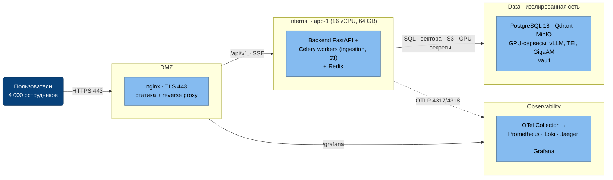
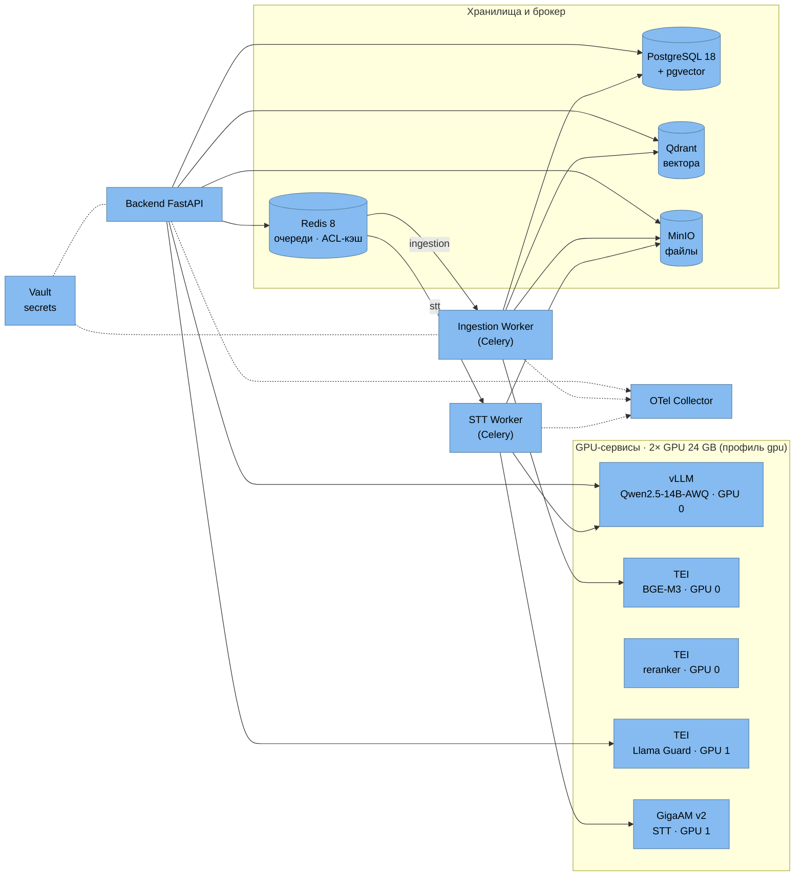

# Deployment Diagram

Физическое размещение: сегментация сети (DMZ / Internal / Data / Observability), GPU-ресурсы, балансировка, секреты.

## Диаграмма 1 — топология сегментов

Межсегментные потоки (кто куда имеет доступ):

## Диаграмма 2 — потоки внутри стека

Кто какие сервисы вызывает (Control Plane → Data Plane):

## Сегментация и правила доступа

| Из | В | Правило |
|---|---|---|
| Пользователи | DMZ | Только HTTPS 443 (nginx) |
| DMZ | Internal | nginx → backend:8000 (SSE для /chat/stream) |
| Internal | Data | Backend/workers → Postgres:5432, Qdrant:6333, MinIO:9000, Vault:8200, GPU-сервисы |
| DMZ / Internet | Data | **Запрещено** (сеть data — `internal: true`) |
| Data | Internet | **Запрещено** (on-premise) |
| Internal | Observability | OTLP 4317/4318 → OTel Collector |
| DMZ | Observability | nginx → Grafana:3000; Jaeger UI:16686 |

## GPU-ресурсы (MVP: 1 сервер, 2 GPU)

| GPU | VRAM | Нагрузка |
|---|---|---|
| GPU 0 | 24 GB | vLLM Qwen2.5-14B-AWQ (~9 GB) + BGE-M3 (~2.2 GB) + reranker (~2.2 GB) + KV-cache |
| GPU 1 | 24 GB | Llama Guard (~5 GB) + GigaAM STT (~1.5 GB) + резерв под Фазу 2 |

GPU-сервисы запускаются профилем `gpu` (`docker compose --profile gpu up -d`); без GPU (локальная разработка на Mac) используется оверлей `docker-compose.local.yml` — LLM через внешний API (Yandex).

## Балансировка нагрузки

- nginx → backend (SSE-совместимое проксирование для стриминга токенов).
- Celery workers — конкурентность по очередям: ingestion ×2, stt ×1 (`--max-tasks-per-child=50` против утечек).
- vLLM — continuous batching + prefix caching внутри инстанса; при масштабировании — vLLM router на несколько GPU-нод.
- PostgreSQL / Qdrant — single-node в MVP

## Секреты

- Vault 1.21 в dev-mode (MVP); production Raft-режим — Фаза 2.
- Backend/workers получают креды БД/MinIO/Qdrant через окружение, чувствительные значения — из `.env`; в K8s — Vault Agent Injector.
- `.env`, TLS-сертификаты — вне git (`.gitignore`).
