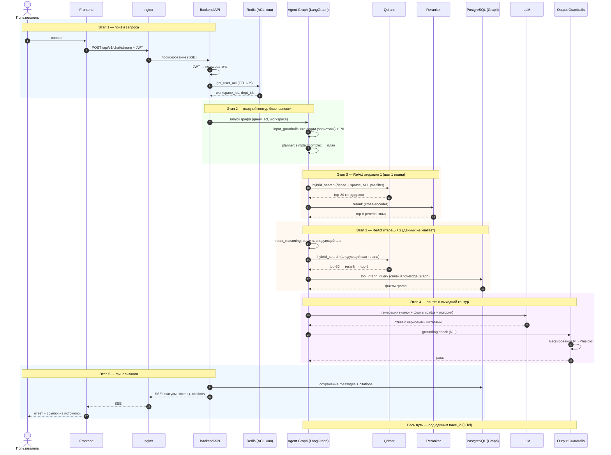

# Sequence Diagram — обработка сложного запроса

Полный флоу: приём → входной контур безопасности → агентный цикл (Plan-and-Solve + ReAct) → синтез → выходной контур → стриминг.

Сценарий: «Найди оклад middle-разработчика» — запрос классифицируется как complex, требует multi-tool retrieval.

## Структура флоу

| Этап | Участники | Что происходит |
|---|---|---|
| 1. Приём | Frontend → nginx → Backend | SSE-соединение, JWT-аутентификация, проверка ACL |
| 2. Входной контур | Input Guardrails | Инъекции + PII (до агентного цикла) |
| 3. Агентный цикл | Planner, Retriever, ReAct | План → итерации поиска → инструмент graph_query |
| 4. Синтез | LLM, Output Guardrails | Генерация → grounding → маскирование PII |
| 5. Финализация | Backend → Frontend | Сохранение в PostgreSQL, SSE-стриминг |

## Диаграмма

## Ключевые точки

1. **ACL до графа** — права пользователя собираются в Backend API (Redis-кэш TTL 60с) и передаются в агент как контекст; retrieval фильтрует чанки физически на уровне Qdrant.
2. **Guardrails встроены в граф** — input_guardrails и output_guardrails являются узлами LangGraph, а не внешними вызовами: блокировка запроса останавливает выполнение до planner'а.
3. **Plan-and-Solve + ReAct** — planner классифицирует сложность: simple идёт в retrieval напрямую, complex получает план (до 3 шагов); максимум итераций — `MAX_ITERATIONS` из конфигурации.
4. **Rerank после каждого retrieval** — top-8 после cross-encoder'а существенно точнее top-20 по гибридному поиску.
5. **Инструменты** — `hybrid_search` (Qdrant) и `graph_query` (Knowledge Graph в PostgreSQL); STT-транскрипция доступна как отдельный tool.
6. **Стриминг** — статусы этапов и токены ответа уходят пользователю по SSE по мере выполнения графа.
