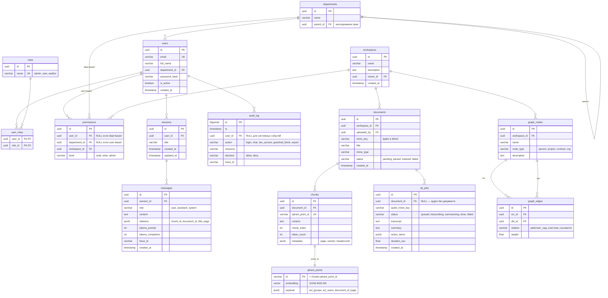

# ER Diagram — модель данных

PostgreSQL (метаданные, RBAC, сессии, аудит, GraphRAG) + Qdrant (вектора) + MinIO (файлы).

## Обзор доменов

| Домен | Сущности |
|---|---|
| RBAC | `users`, `departments`, `roles`, `user_roles`, `permissions`, `workspaces` |
| Документы и RAG | `documents`, `chunks` (+ `qdrant_points` в Qdrant) |
| Диалоги | `sessions`, `messages` |
| STT | `stt_jobs` |
| GraphRAG | `graph_nodes`, `graph_edges` |
| Аудит | `audit_log` |

## Диаграмма

## Примечания

- `qdrant_points` — логическая сущность (реально хранится в Qdrant, показана для полноты).
- **RBAC-механика:** ACL пользователя = его `permissions` + права по иерархии `departments` → преобразуется в Qdrant payload-фильтр (`acl_groups ∈ dept_ids OR acl_users ∋ user_id`) → pre-filter до векторного поиска.
- `audit_log` — append-only: UPDATE/DELETE запрещены триггером, ретенция 1 год.
- `graph_nodes` / `graph_edges` — Knowledge Graph для GraphRAG, извлекается офлайн при ingestion; изоляция по `workspace_id`.
